## Simple AutoEncoder

### Training
By calling the trainModel function you can train a new model

``` phyton
trainModel(model, dataloader=dataLoader, dataLoaderVal=dataLoaderVal, criterion=criterion, scheduler=scheduler,epochs=20, optimizer=optimizer, name=name, startEpoch=startEpoch)
```
You should provide the parameters.

#### Example

```python
model = modelType()
    model.load_state_dict(torch.load(pretrained))
transforms = trans.Compose([
    trans.RandomHorizontalFlip(),
    trans.ToTensor(),
])
dataset = ImageFolder(root="C:\\Users\\best_intern\\Documents\\imagesColor", transform=transforms)
dataLoader = DataLoader(dataset=dataset, shuffle=True, batch_size=128)
datasetVal = ImageFolder(root="C:\\Users\\best_intern\\Documents\\imagesColorVal", transform=transforms)
dataLoaderVal = DataLoader(dataset=datasetVal, shuffle=True, batch_size=128)
optimizer = torch.optim.SGD(
    params=filter(lambda p: p.requires_grad, model.parameters()), 
    lr=0.1,
    momentum=0.9,
    weight_decay=1e-4
)
scheduler = torch.optim.lr_scheduler.ReduceLROnPlateau(optimizer=optimizer, mode="min", factor=0.1, patience=2, verbose=True)
criterion = torch.nn.MSELoss()

trainModel(model, dataloader=dataLoader, dataLoaderVal=dataLoaderVal, criterion=criterion, scheduler=scheduler,epochs=20, optimizer=optimizer, name=name, startEpoch=startEpoch)

```
Scheduler is not necessery can be None, but there is no validation.
Or call the train function in main.py

``` python
train(modelType={MODEL_TYPE}, name={MODEL_NAME})
```

### Testing

Load the model and pass it the images.

It's possible to call 
```
test(modelType : type, imagesPath:str, path : str)
```
And see the original as well as the decoded image

Can compare multiple models with
```
testMultiple(modelType : type, imagesPath : str, paths : list[str])
```
Where imagesPath is the path to your image folder, paths is the list of paths to your saved models.


### Models

AutoEncoderDecoder : ~9.7M params
AutoEncoderDecoderM : ~10.2M params

### After training
Changes after training
#### AutoEncoderDecoder
First image is the original, second after 1 epoch, third after 5 epochs, fourth after 10 etc.
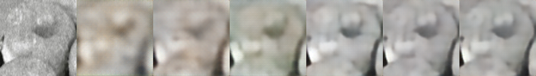


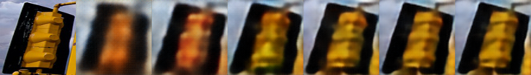
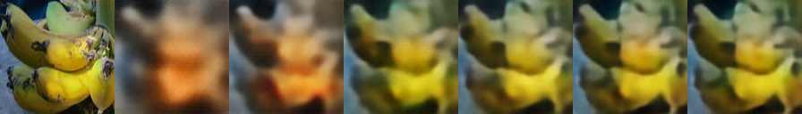

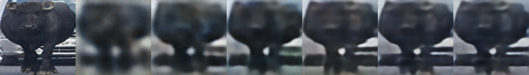


#### AutoEncoderDecoderM
First image is the original, second after 1 epoch, third after 5 epochs, fourth after 10 etc.
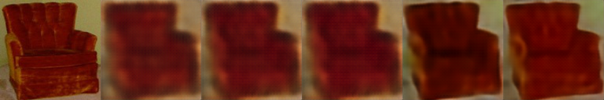
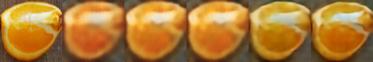

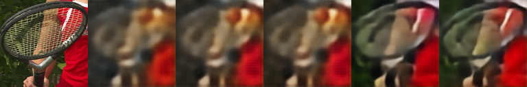

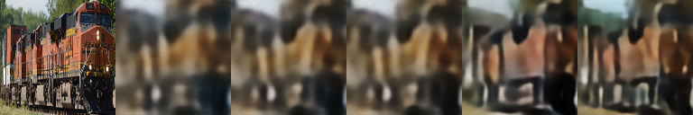
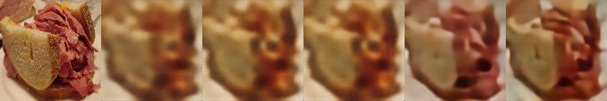


#### AutoEncoderDecoderS
First image is the original, seconda after 1 epoch, third after 10 ...

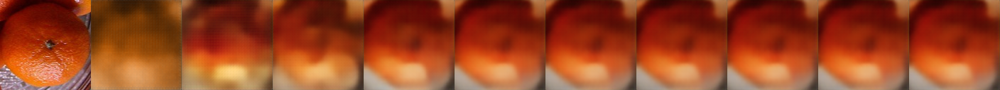
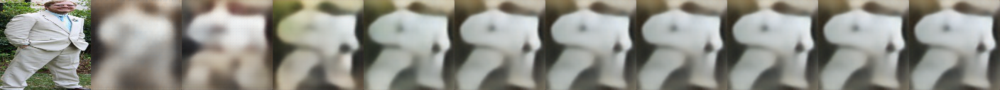


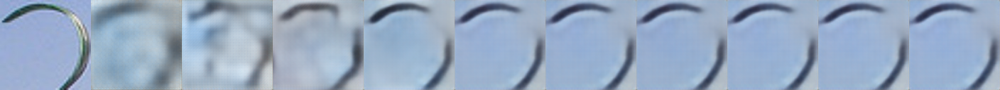

### Requirements
 - pytorch 2.0.1
 - opencv 4.8 - not really needed only for testing
